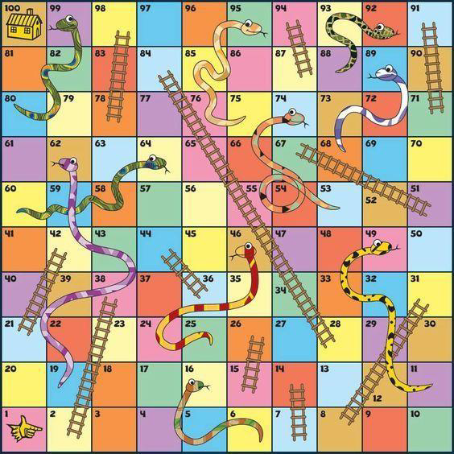

# Snakes and Ladders Game

## Introduction
This repository contains a Python script for simulating the classic board game "Snakes and Ladders". The game includes features such as player movement, dice rolling, handling of snakes and ladders, and determining the winning condition.

## Requirements
- Python 3.x

## Installation
No installation is required. Ensure Python 3.x is installed on your system.

## Usage
To run the game, execute the script `snakes-ladders.py` in a Python environment:
```
python snakes-ladders.py
```
Follow the on-screen instructions to play the game. Players can roll the dice and move their tokens on the game board, encountering snakes and ladders as per the game rules.

## Game Board Reference
Refer to the `snakes-ladders.png` image below for the layout of the snakes and ladders on the game board.


